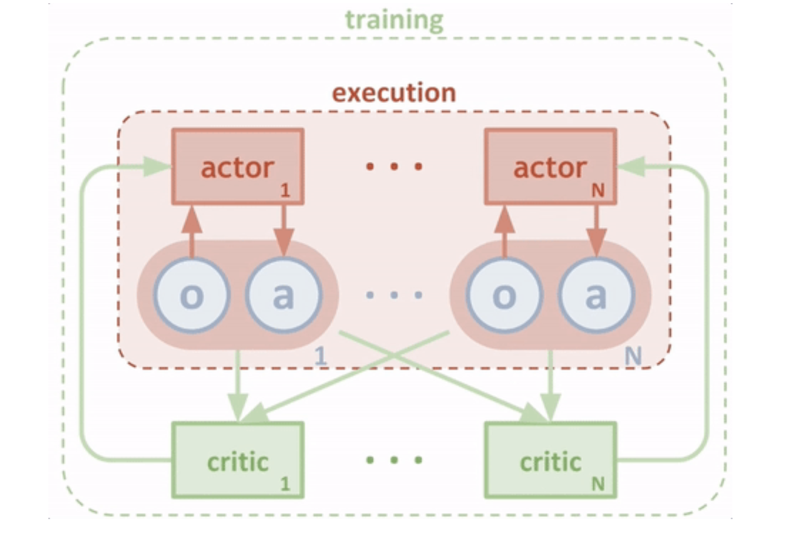
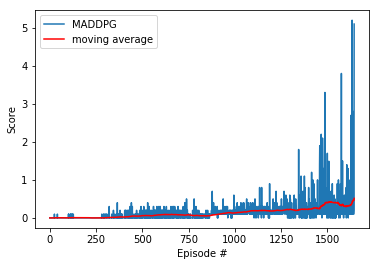
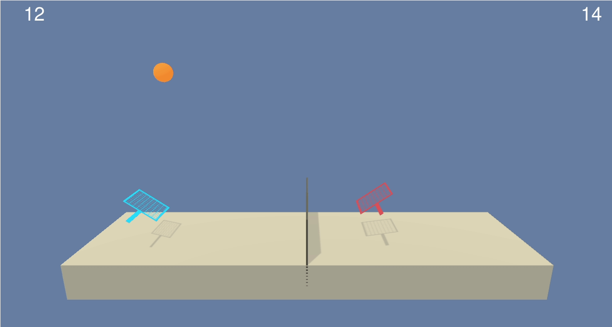
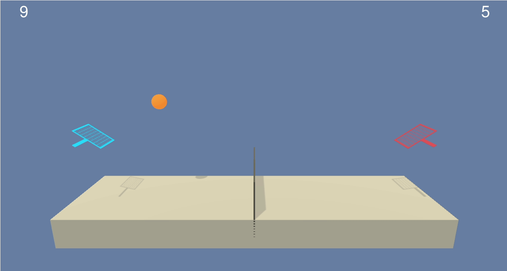

# Project Report

### Algorithm

This project uses [Multi Agent Deep Deterministic Policy Gradient (MADDPG)](https://blog.openai.com/learning-to-cooperate-compete-and-communicate/).



#### DDPG features

* DDPG is basically Deep Q-Learning for continuous action space.
* 2 neural networks - **actor** and **critic**.
* **actor** approximates _deterministic_ policy.
* **critic** approximates action-value function.
* both actor and critic use regular and target weights (so it's technically 4 networks, not 2). We train regular weights, and use target weights for predictions. 
* instead of updating target weights every 10,000 steps, we slowly blend regular weights into target weights at each step (**Soft Update Strategy**).
* The critic is learned using the Bellman equation as in Q-learning.
* The actor is learned using the policy gradient.
* **Experience Replay:** a sequence of experience might be highly correlated. To avoid this, we keep track of a replay buffer (which is a collection of tuples `(state, action, reward, next_state)`) and using experience replay to sample from the buffer at random.

#### Multi Agent DDPG features

* centralized learning and decentralized execution in multiagent environments, allowing agents to learn to collaborate and compete with each other.
* each agent's actor can access the whole environment state, including other actors' states.
* each agent's critic can access the whole environment state and all actors' actions.
* works for both collaboration and competition.

#### Environment

* The observation space consists of 8 variables corresponding to the position and velocity of the ball and racket.
* Each agent receives its own, local observation.
* Two continuous actions are available, corresponding to movement toward (or away from) the net, and jumping.

#### DNN Layers (Actor)

* **input layer**: 16 nodes (both agents' observations)
* **hidden layer**: 256 nodes, ReLU
* **hidden layer**: 128 nodes, ReLU
* **output layer**: 2 nodes, Tanh (size of a continuous action for an agent)

#### DNN Layers (Critic)

* **input layer**: 16 nodes (both agents' observations)
* **hidden layer**: 256 nodes + 4 (actions for both agents), ReLU
* **hidden layer**: 128 nodes, ReLU
* **output layer**: 1 node

#### Exploration vs Exploitation

Exploration remains a key challenge in deep reinforcement learning. Its main purpose is to ensure that the agent’s behavior does not converge prematurely to a local optimum. For continuous action space algorithms like DDPG, exploration is achieved by adding noise to the system:

* action noise (Ornstein-Uhlenbeck process) - as suggested by the original DDPG paper. ([link](https://arxiv.org/abs/1509.02971))
* adaptive parameter noise - adding noise to actor weights [helps improve agent's exploration capabilities](https://blog.openai.com/better-exploration-with-parameter-noise/).

#### Hyperparameters

* **replay buffer size**: `10,000` - _max number of experiences to store in the replay buffer._
* **batch size**: `128` - _how many random experiences to pick from the replay buffer._
* **actor learning rate**: `0.001` - _controls how much we are adjusting the weights of the network._
* **critic learning rate**: `0.001` - _controls how much we are adjusting the weights of the network._
* **discount (Gamma)**: `0.99` - _determines the importance of future rewards: `1` - all future rewards are important, `0` - only immediate reward is important._
* **soft update (Tau)**: `0.001`
* **Ornstein-Uhlenbeck process parameters:** `theta = 0.15`, `sigma = 0.2`
* **Ornstein-Uhlenbeck process coefficient (Epsilon)** - `5` at the beggining (that means we amplifying the noise for better exploration), lineary decays to `0` after 1000 episodes (less exploration, more exploitation). 

### Training



```
Episode 0050    Score: 0.000    Moving Average: 0.004
Episode 0100    Score: 0.000    Moving Average: 0.002
Episode 0150    Score: 0.000    Moving Average: 0.008
Episode 0200    Score: 0.000    Moving Average: 0.008
Episode 0250    Score: 0.000    Moving Average: 0.000
Episode 0300    Score: 0.000    Moving Average: 0.003
Episode 0350    Score: 0.000    Moving Average: 0.015
Episode 0400    Score: 0.000    Moving Average: 0.027
Episode 0450    Score: 0.000    Moving Average: 0.050
Episode 0500    Score: 0.000    Moving Average: 0.059
Episode 0550    Score: 0.100    Moving Average: 0.057
Episode 0600    Score: 0.000    Moving Average: 0.083
Episode 0650    Score: 0.100    Moving Average: 0.087
Episode 0700    Score: 0.200    Moving Average: 0.082
Episode 0750    Score: 0.100    Moving Average: 0.082
Episode 0800    Score: 0.200    Moving Average: 0.065
Episode 0850    Score: 0.000    Moving Average: 0.053
Episode 0900    Score: 0.100    Moving Average: 0.086
Episode 0950    Score: 0.100    Moving Average: 0.125
Episode 1000    Score: 0.100    Moving Average: 0.133
Episode 1050    Score: 0.100    Moving Average: 0.157
Episode 1100    Score: 0.100    Moving Average: 0.188
Episode 1150    Score: 0.100    Moving Average: 0.196
Episode 1200    Score: 0.200    Moving Average: 0.183
Episode 1250    Score: 0.200    Moving Average: 0.193
Episode 1300    Score: 0.300    Moving Average: 0.222
Episode 1350    Score: 0.000    Moving Average: 0.218
Episode 1400    Score: 0.800    Moving Average: 0.233
Episode 1450    Score: 0.300    Moving Average: 0.254
Episode 1500    Score: 0.300    Moving Average: 0.397
Episode 1550    Score: 0.200    Moving Average: 0.394
Episode 1600    Score: 0.300    Moving Average: 0.312
Episode 1646    Score: 5.100    Moving Average: 0.514

Environment solved in 1646 episodes!
```

### Results

Random agent



Smart agent (after training)



### Future ideas

*  Tuning hyperparameters manually is a very long and tedious process. Random search or [Bayesian optimization](https://cloud.google.com/blog/products/gcp/hyperparameter-tuning-cloud-machine-learning-engine-using-bayesian-optimization) might be a better approach.
